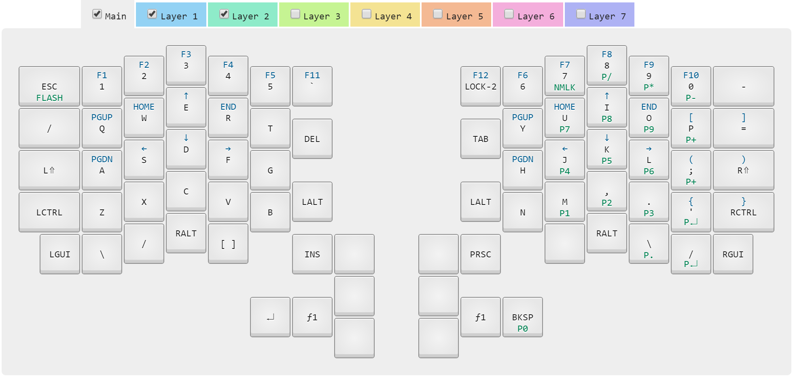

# Kiibohd kll compiler

My layout for the [Infinity Ergodox](http://input.club/devices/infinity-ergodox) keyboard.

## Editing

The layout files are in kiibohd/*.kll.

- fred-0.kll is the main layer
- fred-1.kll is the layer with arrows, function keys and braces
- fred-2.kll is the layer with the keypad

## Workflow

My workflow uses the (dockerized version)[https://hub.docker.com/r/fmerizen/ergodox-infinity-layout/] of the KLL compiler. First make sure that you have a working docker installation.

1. Edit fred-*.kll to my liking
2. If I added or removed a layer, I need to change the value of PartialMaps in kiibohd/fred.bash accordingly
3. Run `./compile.sh fred.bash` (that's correct, there is no directory before fred.bash although fred.bash is in the kiibohd subdirectory)
4. The compiled firmware is now available as kiibohd/*.dfu.bin
5. Flash the keyboard with [dfu-util](https://github.com/kiibohd/controller/wiki/Loading-DFU-Firmware). It's enough to flash the master half of the keyboard (the one that's plugged into the keyboard). For instance, I always have the right half plugged into the computer; the left half is plugged into the right half. So I flash right_kiibohd.dfu.bin.
